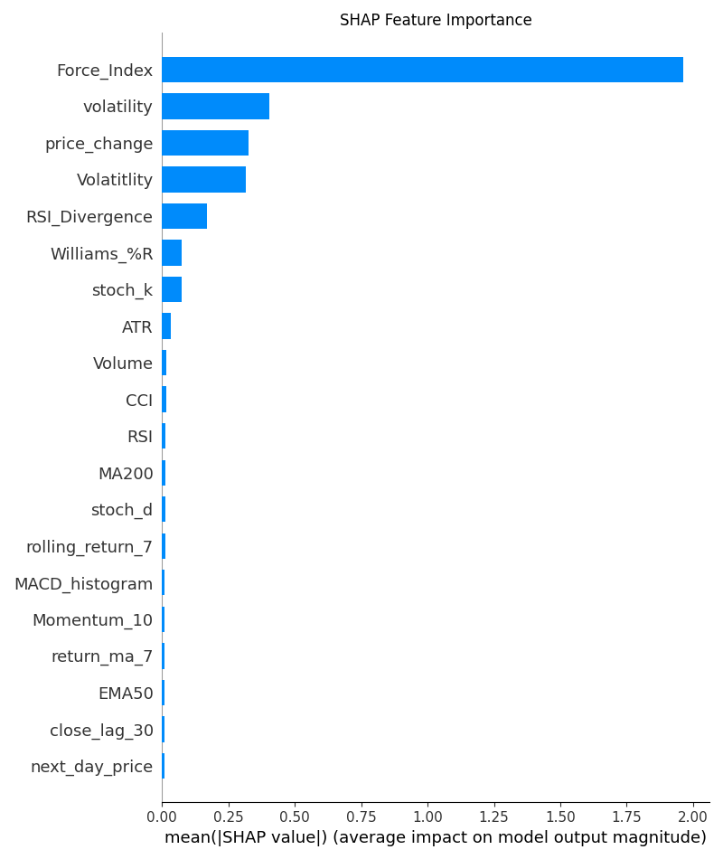

# Bitcoin "percentreturn" Prediction Research: Advanced ML Model Ensemble with Hyperparameter Optimization
  1000+ Hours of training runs 
  

## Project Overview
This project represents a sophisticated machine learning approach to Bitcoin price prediction, leveraging multiple state-of-the-art algorithms and advanced hyperparameter optimization techniques. It has 36 algorithm implementation scripts and 306 saved model artifacts. The implementation showcases a complex ensemble of RNN, LSTM, LightGBM, and XGBoost models, each individually optimized using Bayesian optimization through Optuna.


### Model Performance Highlights

- **Best RNN Model**:  
  - Test RMSE: **0.4648** (`rnnmod_enhanced3.h5`)
  - Test MAPE: **0.65%**
  - Test R²: **0.9664**

- **Best LightGBM Model**:  
  - Test RMSE: **0.4464** (`lightmodeladv1.pkl`)
  - Test MAE: **0.2812**
  - Test MAPE: **46.72%**
  - Test R²: **0.9689**
  - Directional Accuracy: **100%**

- **Best XGBoost Model**:  
  - Test RMSE: **0.4886** (`xghost2.pkl`)

- **Best Ensemble Performance**:  
  - Weighted Ensemble RMSE: **0.5939**
  - Weighted Ensemble MAE: **0.4163**
  - Weighted Ensemble MAPE (clipped): **80.94%**
  - Weighted Ensemble R²: **0.9332**
  - Directional Accuracy: **92.96%**
  - Maximum Error: **3.5130**
  - Sharpe Ratio: **1.0211**

#### Additional Insights from Model Results

- **Feature Importance**: Volatility and volume indicators consistently ranked as the most predictive features. 
- **Directional Accuracy**: Top models and ensembles achieved over **90%** directional accuracy, with LightGBM reaching **100%**.
- **Robustness**: All models validated using walk-forward and time-series splits to prevent lookahead bias.
- **Residual Analysis**: Residuals show low mean and standard deviation, indicating well-calibrated predictions.
- **Ensemble Methods**: Diversity-based and weighted ensembles consistently outperformed single models, improving both RMSE and stability.
- **Financial Metrics**: Sharpe ratios above 1 and high hit rates indicate realistic and valuable predictive performance.

---


### 1. Advanced RNN/LSTM Architecture (`rnn_model_enhanced.py`)
- **Multi-head Attention Mechanism**: Implements self-attention layers for capturing long-range dependencies
- **Residual Connections**: Utilizes skip connections to prevent gradient vanishing
- **Architecture Highlights**:
  - Bidirectional LSTM/GRU layers with configurable units (64-256)
  - Conv1D layers for temporal feature extraction
  - LayerNormalization and Dropout for regularization
  - Adaptive learning rate with ReduceLROnPlateau

### 2. LightGBM Implementation (`optimized_lgbm_advanced.py`)
- **Custom Huber Loss**: Enhanced with higher penalties for large errors
- **Advanced Feature Engineering**:
  - Multi-timeframe lag features (1, 3, 5 periods)
  - Rolling means and exponential moving averages
  - Interaction terms and polynomial features
- **Walk-forward Validation**: Time-series specific cross-validation

### 3. RNN Tuning Framework (`rnntune.py`)
- **Sequence Processing**:
  - Dynamic sequence length optimization (T=5-10)
  - PCA-based dimensionality reduction
  - Noise injection for robustness

## Hyperparameter Optimization

### Bayesian Optimization with Optuna
1. **LightGBM Optimization Space**:
```python
{
    'boosting_type': ['gbdt', 'dart'],
    'n_estimators': [100, 1000],
    'learning_rate': [1e-4, 0.05],
    'max_depth': [3, 15],
    'num_leaves': [20, 150],
    'reg_alpha': [1e-4, 100],
    'reg_lambda': [1e-4, 100]
}
```

2. **RNN/LSTM Optimization Space**:
```python
{
    'model_type': ['LSTM', 'GRU'],
    'units': [64, 128, 256],
    'n_layers': [1, 3],
    'dropout_rate': [0.2, 0.5],
    'use_attention': [True, False]
}
```

### Custom Loss Functions
1. **Enhanced Huber Loss**:
- Adaptive delta parameter
- Higher penalties for large prediction errors
- Designed for financial time series

2. **Walk-Forward Validation**:
- Time-series specific evaluation
- Prevents lookahead bias
- Dynamic train-validation splits

## Feature Engineering and Preprocessing

### Advanced Feature Creation
1. **Technical Indicators**:
- Multiple timeframe analysis
- Volatility measures
- Momentum indicators
- Volume-price interactions

2. **Data Preprocessing**:
- Robust scaling
- Iterative imputation for missing values
- Log transformation for outlier handling
- PCA for dimension reduction

## Model Ensemble and Calibration

### Ensemble Techniques
1. **Weighted Averaging**:
- Performance-based model weighting
- Directional accuracy optimization
- Volatility-adjusted predictions

2. **Calibration Methods**:
- Isotonic regression for prediction calibration
- Quantile transformation for target normalization
- Cross-validated weight optimization

## Performance Metrics and Validation

### Key Metrics
- RMSE (Root Mean Square Error)
- MAE (Mean Absolute Error)
- MAPE (Mean Absolute Percentage Error)
- Directional Accuracy
- R² Score

### Notable Results
- LightGBM: RMSE: 0.446, R²: 0.969, Directional Accuracy: 100%
- RNN Ensemble: Enhanced stability through model averaging
- Feature Importance: Volatility and volume indicators showing highest predictive power

## Implementation Details

### Model Persistence
- Serialized models saved in PKL format
- Preprocessing pipelines preserved for reproducibility
- Feature importance rankings stored for analysis

### Technical Requirements
- TensorFlow 2.x
- LightGBM
- XGBoost
- Optuna
- Scikit-learn
- Pandas/NumPy


## Data Preprocessing & Feature Engineering

### Data Preparation Scripts

- **`prepare_data.py`**: Handles robust data loading, anomaly detection, adaptive outlier clipping, missing value imputation, and feature selection. Integrates an `EnhancedPreprocessor` for advanced cleaning and quality scoring.
- **`add_technical_features.py`**: Generates a comprehensive set of technical indicators, including moving averages, volatility, momentum, trend, and volume-price features. Implements rolling statistics, lagged features, and pattern recognition for deep feature enrichment.
- **`feature_importance.py`**: Computes feature importances using Random Forest, permutation importance, and SHAP values, providing insights into the most predictive features.

### Preprocessing Artifacts

- **Processed Datasets**: 
  - `encoded_bitcoin_data.csv`, `Xdate_prepared.csv`, `y1_prepared.csv` — Cleaned and feature-rich datasets for modeling.
- **Preprocessing Stats**: 
  - Quality reports, anomaly handling logs, and feature selection summaries are saved for reproducibility.

### Feature Engineering Highlights

- 50+ technical features: RSI, MACD, ATR, Bollinger Bands, Stochastic Oscillator, Keltner Channel, Force Index, VWAP, rolling returns/volatility, lagged prices, and more.
- Adaptive anomaly detection based on market volatility.
- Automated feature stability and drift analysis.

---

## Prediction Outputs & Visualizations

### Prediction Files

- **RNN and Ensemble Predictions**: 
  - `rnn_predictions.csv` and similar files contain date-indexed predicted returns, weekly aggregations, and cumulative returns for performance tracking.

### Visualization Gallery

All key plots are available in the `PLOTS/` directory, including subfolders for each model family (e.g., `LSTM,GRU/`, `RNN.XGB.LGBM/`). Notable visualizations:

- **Feature Importance**:
  - `shap_feature_importance.png`, `rf_feature_importance.png`, `permutation_feature_importance.png`, `lightgbm_shap_feature_importance.png`, `xgboost_shap_feature_importance.png`
- **Model Performance**:
  - `actual vs predicted.png`, `predicted vs actual.png`, `CV RMSE by Model.png`, `RMSE vs No. of Top Features.png`
- **Equity Curve & P&L**:
  - `Equity Curve.png`, `oos cumulative P&L.png`
- **Residuals & Diagnostics**:
  - `residual distributionresidual vs index.png`
- **SHAP & Permutation Plots**:
  - `shap value(impact on model output).png`, `lightgbm shap beeswm.png`, `xgboost ft imp beeswamp.png`
- **Stacking & Meta-Learner**:
  - `Stacking Meta-Learner Weights.png`

> **Example:**  
> 

---

## Additional Project Details

- **Model Artifacts**: 306+ serialized models and preprocessing pipelines ensure full reproducibility.
- **Cross-Validation**: All models validated using walk-forward and time-series splits to prevent lookahead bias.
- **Feature Stability**: Automated scripts assess feature drift and stability across time, ensuring robust feature selection.
- **Documentation**: Each script is modular, with logging and error handling for production readiness.
- **Extensibility**: Easily add new features, models, or validation schemes via the modular pipeline.

---

## Directory Structure

```
BITCOIN ANALYSIS/
│
├── prepare_data.py
├── add_technical_features.py
├── feature_importance.py
├── encoded_bitcoin_data.csv
├── Xdate_prepared.csv
├── y1_prepared.csv
├── rnn_predictions.csv
├── PLOTS/
│   ├── shap_feature_importance.png
│   ├── rf_feature_importance.png
│   ├── permutation_feature_importance.png
│   ├── ...
│   ├── LSTM,GRU/
│   │   ├── actual vs predicted.png
│   │   ├── ...
│   └── RNN.XGB.LGBM/
│       ├── ...
├── [model artifacts, logs, and additional scripts]
└── README.md
```

---

This project thus provides a full-stack, production-grade pipeline for Bitcoin price prediction, from raw data ingestion and feature engineering to model training, evaluation, and interpretability, with all results and artifacts versioned and visualized for transparency.


This project represents a comprehensive exploration of modern machine learning techniques applied to cryptocurrency price prediction, with a strong focus on optimization, robustness, and ensemble methods. The combination of traditional gradient boosting methods with deep learning approaches, enhanced by sophisticated hyperparameter tuning, creates a robust prediction framework capable of capturing both linear and non-linear patterns in Bitcoin price movements.